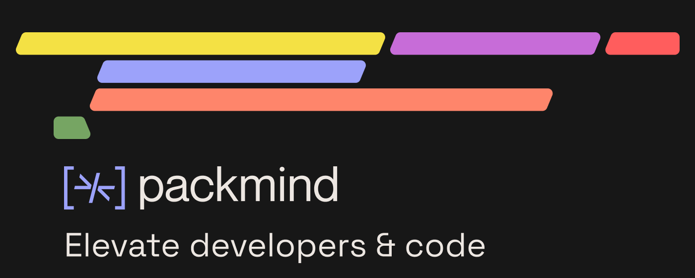

# ⚠️ Repository Status

Since May 2025, a new Helm Chart is available for Packmind AI: [https://github.com/PackmindHub/packmind-helm-chart](https://github.com/PackmindHub/packmind-helm-chart).

If you **have not yet deployed** Packmind, you should check this Helm Chart instead.

If you **have already deployed** Packmind, you can still continue to use this chart, but make sure you use the latest images.
This repository will still be maintained for current users at least until the end of 2025.

## New Docker images since May 2025 7th

The release of Packmind AI (ex-Packmind) has introduced a new versioning starting from 1.0.0.

The `values.yaml` has been updated to use new Docker images. If you've overridden these images, you should consider this migration:

| Until Helm Chart 2.0.1 | Since Helm Chart 3.0.0        |
|------------------------|-------------------------------|
| `promyze/promyze-api` | `packmind/packmind-api`       |
| `promyze/promyze-proxy` | `packmind/packmind-proxy`     |
| `promyze/promyze-suggestions` | `packmind/packmind-detection` |
| `promyze/packmind-aiagent` | `packmind/packmind-ai-agent`   |

New releases of the Chart will include the new images tags.

# Helm chart for Packmind (ex-Promyze)

[](https://github.com/promyze/helm-charts/actions/workflows/ci.yaml)
[](https://github.com/promyze/helm-charts/actions/workflows/release.yaml)

This Helm chart will install [Packmind](https://packmind.com/), the collaborative platform to raise your coding standards, on your Kubernetes cluster.

Note: Promyze has been renamed to Packmind in January 2024.

## Usage

[Helm](https://helm.sh) must be installed to use the charts. Please refer to Helm's [documentation](https://helm.sh/docs) to get started.

Once Helm has been set up correctly, add the repository:

```bash
helm repo add promyze https://promyze.github.io/helm-charts
```

If you had already added this repo earlier, run `helm repo update` to retrieve the latest versions of the packages. You can then run `helm search repo promyze` to see the charts.

Before installing the chart, you can check the default **values** [here](https://github.com/promyze/helm-charts/blob/main/charts/promyze/values.yaml), especially about the **MongoDB 4.x** connection.

## MongoDB 4.x connection

You have 2 options to deal with MongoDB.

### 1. Use the embedded MongoDB 4.x

Setting the `app.databaseEmbedded.enabled` at `true` will run a MongoDB instance in the cluster.

```
app:
  ...
  databaseEmbedded:
    enabled: true # use an internal mongodb in the cluster
```

The `app.databaseEmbedded.enabled` at `true` will run a MongoDB instance in the cluster.

There is a section `app.databaseEmbedded.pvc` to deal with the persistent storage, enabled by default.

### 2. Use your instance MongoDB 4.x

Setting the `app.databaseEmbedded.enabled` at `false` will require you to indicate the URI of your MongoDB instance.

See the `app.databaseUri` section to set the URI.

```
app:
 ...
 databaseUri:
    value: "mongodb://mongodb:27017/promyze" # You can set the direct URI
    # secret: # Or pass it as a secret
    #   name: mongodb-secret
    #   key: mongodb-uri
```

## Access Packmind

Check the [Contributing](docs/CONTRIBUTING.md) guide to see how to use  **ingress** to connect to Packmind.

## Run the chart

To install the chart:

```bash
helm upgrade --install packmind promyze/promyze --create-namespace --namespace packmind
```

To uninstall the chart and clean-up the cluster:

```bash
helm delete packmind
kubectl delete ns packmind
```

## Go further

Look at [Contributing](docs/CONTRIBUTING.md) if you would like to update this repository.
